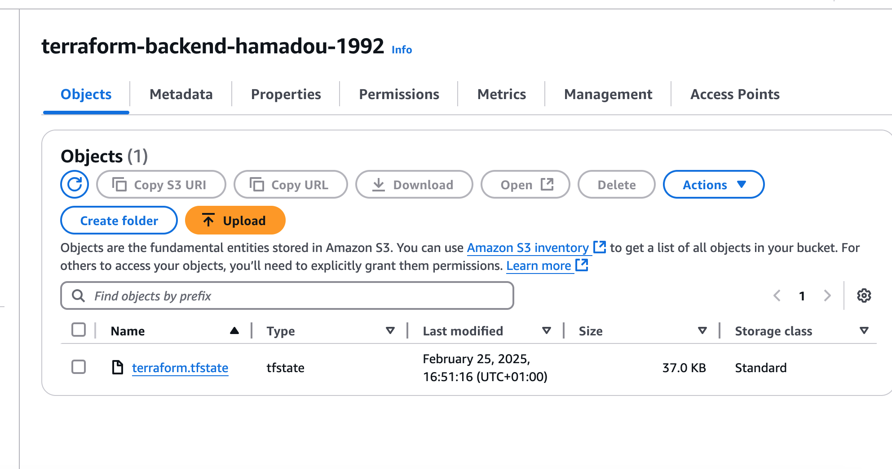
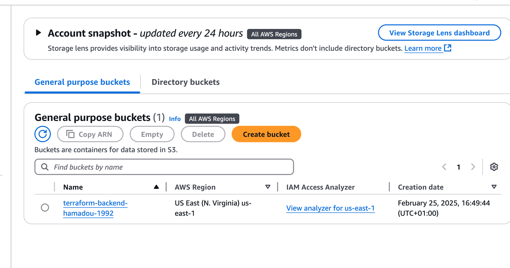
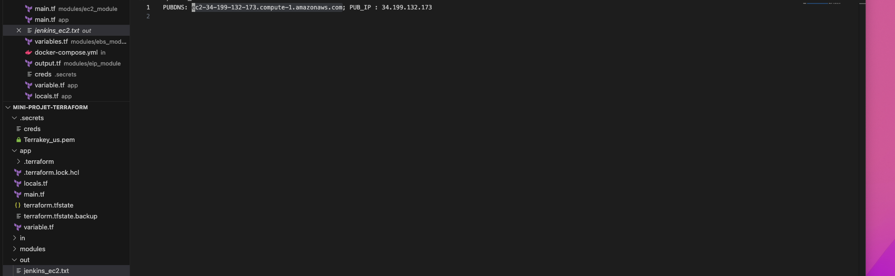
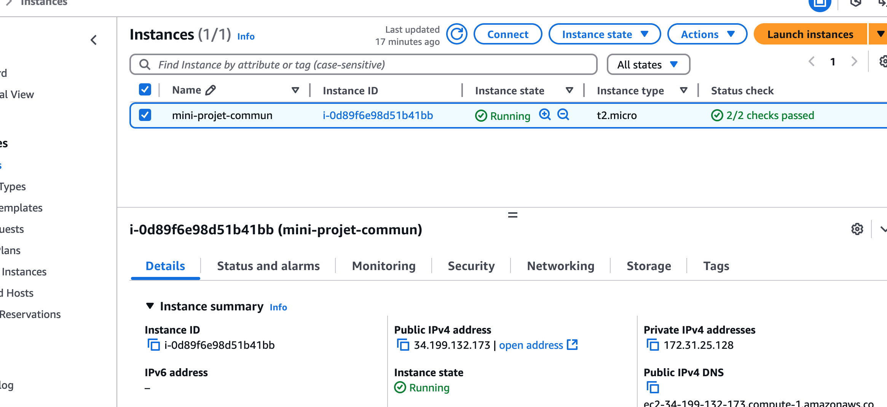
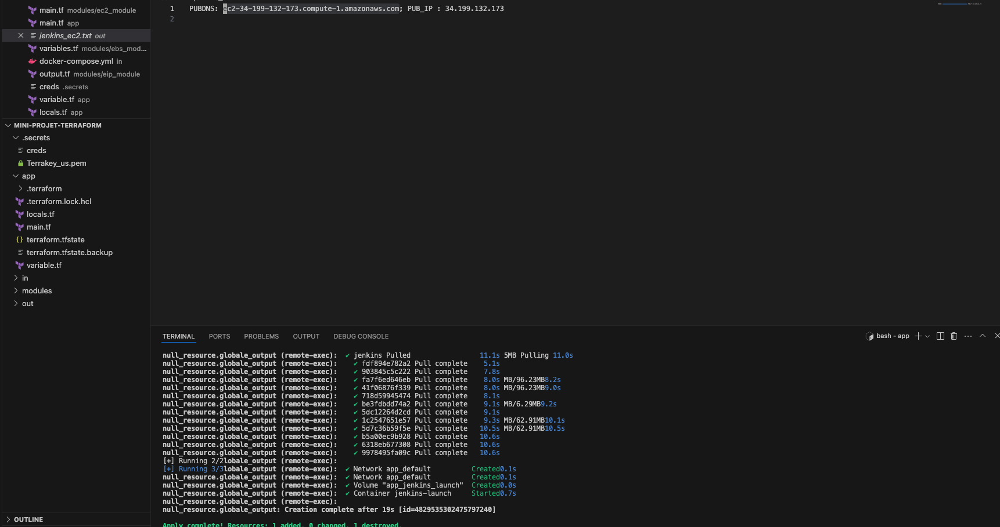
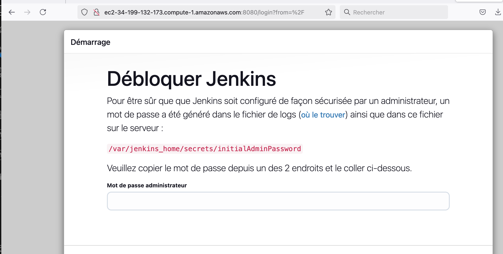

# Presentation

le but de ce projet est mettre en place une infrastructure sur AWS pour la creation d'un serveur jenkins avec Terraform.

## Arborescence du projet

Voici l'arborescence de notre projet :

```
project/
├── app/
│   ├── main.tf
│   └── locals.tf
├── s3/
│   ├── main.tf
├── modules
│   ├── ebs_modules/
│   │   ├── main.tf
│   │   ├── output.tf
│   │   └── variable.tf
│   ├── ec2_modules/
│   │   ├── main.tf
│   │   ├── output.tf
│   │   └── variable.tf│
│   ├── eip_modules/
│   │   ├── main.tf
│   │   ├── output.tf
│   ├── key_modules/
│   │   ├── main.tf
│   │   ├── output.tf
│   │   └── variable.tf
│   ├── sg_modules/
│   │   ├── main.tf
│   │   ├── output.tf
│   │   └── variable.tf
├── README.md
├── out/
├── in/
└── .gitignore 
```

nous utilisons le s3 pour stocker le tfsate de notre projet. ainsi le repertoire s3 contient les informations necessaire a la ccreation de notre s3 bucket.

tout d'abord il faut creer le bucket s3 
```
cd /s3
terraform validate 
terraform plan 
terraform apply

```




pour lancer notre code nous avons avons d'etre dans le repertoire app
```
cd /app 
terraform validate 
terraform plan 
terraform apply

```

le repertoire out contient nos elements de sorties c'est a dire ip publique de l'instance crée et son nom de domaine.



le repertoire in contient les inputs files (pour notre cas le docker compose contenant les images jenkins que nous demarrons avec les provisioners remote_exec )

